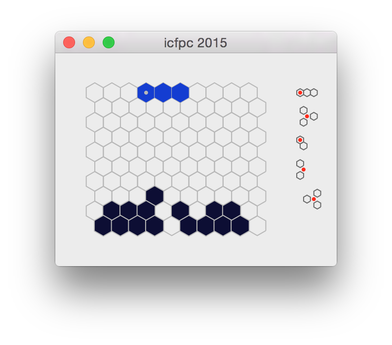

paiv - icfpc 2015
=================

Notes
-----

For some reason, I thought I'm required to use all the units from a source, so haven't published a thing.

Implementation
--------------

* solver - C/C++
* visualizer - Objective-C

Tetris player
-------------

